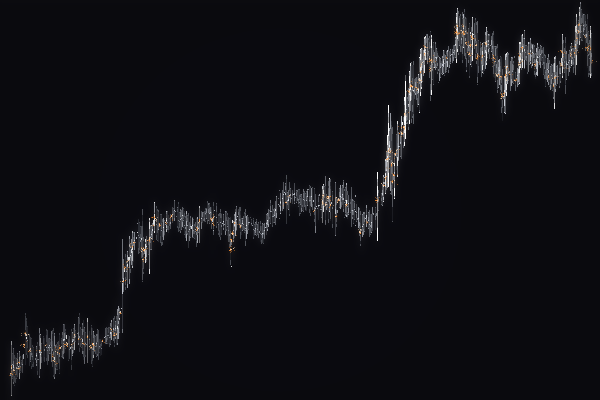

# Tesla Data Art Series

**Three visualizations of TSLA stock data (2010–2025), each inspired by a different facet of the Tesla universe.**

---

## A. Neural Surge


A neural network awakens along Tesla's stock price trajectory. Each month of TSLA's 15-year history becomes a node in a living nervous system — dendrites branch outward when the stock surges, contract inward during declines, and fire synaptic bursts at moments of extreme volatility. Inspired by the Neuralink aesthetic and circuit board geometry.

## B. Cybertruck



Inspired by the infamous Cybertruck window-breaking incident. The entire canvas is a sheet of armored glass, shattered by impact events in Tesla's history. A Voronoi tessellation divides the surface into angular shards — small, dense fragments near impact points (S&P 500 inclusion, the 2022 crash, Cybertruck delivery) and large, calm facets in quiet periods. Each shard's brightness maps to the stock price at that moment in time: dark gunmetal on the left (the low-price IPO years), gleaming chrome on the right (the $400 era). Radial crack lines, orange welding sparks, and cold steel — the anti-thesis of Neural Surge's organic warmth.

## C. Autopilot Vision


You are riding in the driver's seat of Tesla's Full Self-Driving system, looking down a road that stretches from IPO (the vanishing point) to today (the foreground). Stock price manifests as LiDAR terrain walls flanking the road — low walls in the early years, towering cliffs of cyan point-cloud data during the 2020–2021 surge. Lane lines pulse with volatility. HUD targeting brackets mark key events: Model 3 launch, S&P 500 inclusion, the 2022 crash, and Cybertruck delivery.

---

## The Concept

Each piece uses the same underlying dataset — Tesla's stock history from its June 2010 IPO through April 2025 — but interprets it through a completely different lens. Together, they form a triptych: organism, machine, interface.

## How Data Becomes Art

### Data Sources

| Dataset | Points | Used By |
|---|---|---|
| Monthly OHLCV | 179 months | Neural Surge, Autopilot Vision |
| Daily OHLCV | 3,718 days | (available for future use) |

**179 monthly data points** (June 2010 IPO → April 2025) drive Neural Surge's visual elements:

| Data Metric | Visual Expression |
|---|---|
| Closing price | Y-position on canvas (log scale) |
| Month-over-month change | Dendrite direction — up for growth, down for decline |
| Volatility (absolute change) | Dendrite length, branching depth, and spread |
| Trading volume | Trunk nerve thickness, branch density |

### Layers

1. **Circuit Grid** — A faint PCB texture anchors the background. Year lines and price levels form a subtle coordinate system. L-shaped trace connectors at quarterly intervals reinforce the technology metaphor.

2. **L-System Dendrites** — At each monthly node, recursive fractal branches grow using an L-system grammar. Branch length decays by the golden ratio (φ = 0.618) at each generation, up to 5 levels deep. Cubic Bézier curves give each branch an organic S-curve. Growth months branch upward; decline months branch downward.

3. **Trunk Nerve** — A Catmull-Rom spline traces the stock price as the system's central axon. Line width pulses with trading volume — thicker during high-activity months. Color shifts from deep red through Tesla Red to gold as momentum builds.

4. **Synapse Firing** — Months with >25% normalized price movement trigger multi-layered glow nodes: a white-hot core surrounded by colored halos, with micro-connection rays radiating outward in Bézier arcs.

### Color Palette — Tesla Red

| Role | Color |
|---|---|
| Background | Charcoal `#0D0D0D` |
| Strong decline | Deep gray `#1E1E1E` |
| Moderate decline | Dark red `#501414` |
| Stable | Tesla Red `#CC0000` |
| Growth | Bright red `#E31937` |
| Surge | Orange `#FF6600` |
| Peak | Gold `#FFD700` |

### Reading the Timeline

- **2010–2019** (left third): Sparse, thin dendrites. The neural network is dormant — a quiet organism accumulating energy during Tesla's long pre-profitability years.
- **2020–2021** (center-right): Explosive branching. Synapses fire in rapid succession. The network reaches maximum activation — Tesla's stock rises ~1,500% in this period.
- **2022** (sharp dip): Dendrites abruptly contract downward. The network dims. A visible moment of signal loss.
- **2023–2025** (far right): Recovery. The network re-illuminates, though with less intensity than the 2020 mania.

## Technical

- **Resolution:** 6000 × 4000 px (print-ready at 300 DPI for ~50 × 33 cm)
- **Stack:** Python 3.8, Pillow (PIL), NumPy
- **Rendering:** Deterministic (seed = 42). Same code always produces the same image.
- **Data:** Yahoo Finance API, monthly OHLCV

```bash
# Generate all three variations
/usr/local/bin/python3 generate_neural_surge.py
/usr/local/bin/python3 generate_cybertruck.py
/usr/local/bin/python3 generate_autopilot.py
```

## License

Data art by [Jaewon Shim](https://github.com/ryle). Stock data from Yahoo Finance.
